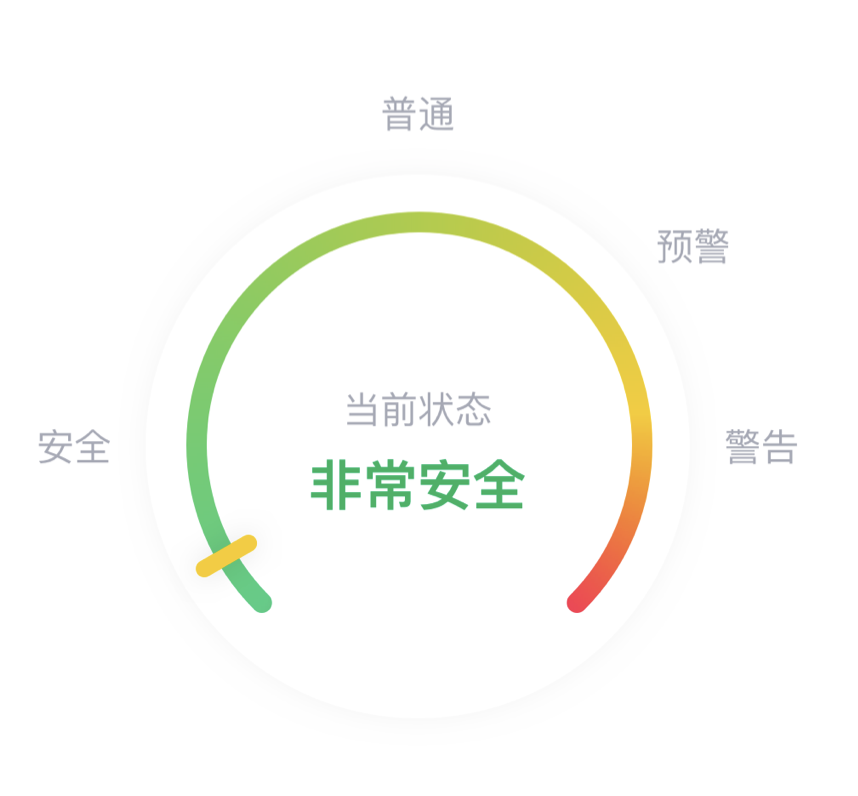

# dashboardview
A customized view project. DashBoardView. 仪表盘控件.

# Reference
[Publish your Android library to jCenter](https://medium.com/@LopezMikhael/publish-your-android-library-to-jcenter-5c6df287db11)
# Potential Issues
* Skipping upload for missing file 'xx/../pom-default.xml'
  * Run <b> ./gradlew `--stacktrace --info` clean build generatePomFileFor`xxx`Publication bintrayUpload -PbintrayUser=<bintray name> -PbintrayKey=<bintray key> -PdryRun=false</b> 
    * where, `--stacktrace --info` is for debugging and optional; `xxx` means your publication name, in my case, it's `MyPublication`
# Adding to your project
* Add following configuration in your build.gradle file.

```
repositories {
    jcenter()
    maven { url "https://jitpack.io" }
}

dependencies {
    implementation 'me.bytebeats:dbv:1.0.2'
}
```

# Usage

```
    <me.bytebeats.dbv.DashBoardView
        android:id="@+id/dbv"
        android:layout_width="200dp"
        android:layout_height="160dp"
        app:dbv_desc="当前状态"
        app:dbv_descColor="#A6A9B6"
        app:dbv_progress="30"
        app:dbv_descSize="11sp"
        app:dbv_cursorColor="#F8CC00"
        app:dbv_backColor="@color/colorPrimary"
        app:dbv_title="非常安全"
        app:dbv_titleColor="#07B360"
        app:dbv_titleSize="25sp"
        app:dbv_textPadding="10dp"
        app:layout_constraintBottom_toBottomOf="parent"
        app:layout_constraintLeft_toLeftOf="parent"
        app:layout_constraintRight_toRightOf="parent"
        app:layout_constraintTop_toTopOf="parent" />

```
 Added TimeInterpolators. Used as below:
 ```
    DashBoardView.rimInterpolator = BounceInterpolator()
    // or
    DashBoardView.cursorInterpolator = SpringInterpolator()
 ```

# Visual Effects



# TODO

* Texts around the edge of the DashBoardView
 
## MIT License

    Copyright (c) 2021 Chen Pan

    Permission is hereby granted, free of charge, to any person obtaining a copy
    of this software and associated documentation files (the "Software"), to deal
    in the Software without restriction, including without limitation the rights
    to use, copy, modify, merge, publish, distribute, sublicense, and/or sell
    copies of the Software, and to permit persons to whom the Software is
    furnished to do so, subject to the following conditions:

    The above copyright notice and this permission notice shall be included in all
    copies or substantial portions of the Software.

    THE SOFTWARE IS PROVIDED "AS IS", WITHOUT WARRANTY OF ANY KIND, EXPRESS OR
    IMPLIED, INCLUDING BUT NOT LIMITED TO THE WARRANTIES OF MERCHANTABILITY,
    FITNESS FOR A PARTICULAR PURPOSE AND NONINFRINGEMENT. IN NO EVENT SHALL THE
    AUTHORS OR COPYRIGHT HOLDERS BE LIABLE FOR ANY CLAIM, DAMAGES OR OTHER
    LIABILITY, WHETHER IN AN ACTION OF CONTRACT, TORT OR OTHERWISE, ARISING FROM,
    OUT OF OR IN CONNECTION WITH THE SOFTWARE OR THE USE OR OTHER DEALINGS IN THE
    SOFTWARE.
